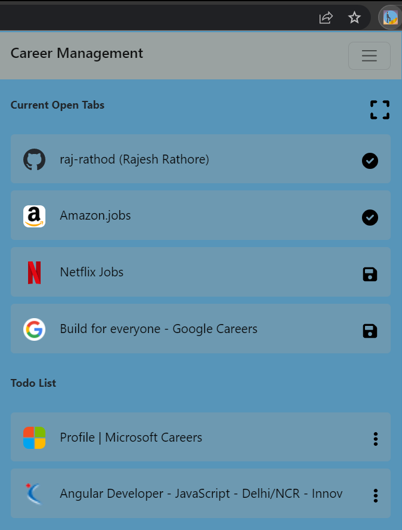
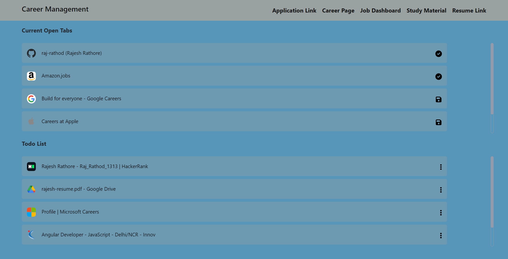
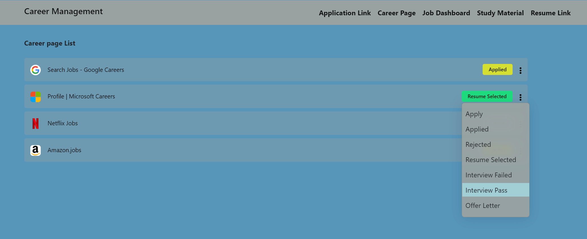

# Career Management chrome extension

 
> I have developed **"Career Management Extension"**. It is very useful for the **students, employees** as you can access all your **application links, applied links, study material, resume, status of applied links** at one place. Inshort this mini portal for you to track everything at one place.

After adding this extension to the google chrome  all the open tabs will be visible inside the extension with save button. When you are saving the tab,  select a category of the tab.

People can save these tabs inside below categories:
* Application Link
* Career Page
* Job Dashboard
* Study Material
* Resume Link

Adding it to above categories, it will go to to-do list and once task is completed , you can move it to completed task.

<!-- ### [Check Release](https://raj-rathod.github.io/tic-toc-game/) -->

### Screenshots
 
 

### Set Status
 

By visiting the saved links inside different categories you can also update status for your saved link like : 

* Apply
* Applied
* Rejected
* Resume Selected
* Interview Fail
* Interview Pass
* Offer Letter

***Do star, fork and share the repo to show your support, it would help others too!***    
  
 Let me know your views or any changes or improvements or contribute to make better for others 
 
 :heart: ***Thank you all for Forking this repository and contribute***  :heart:
